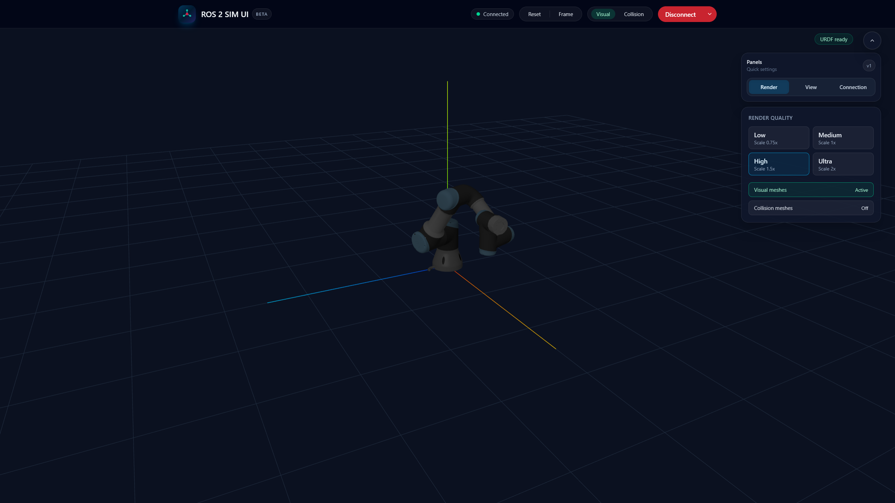
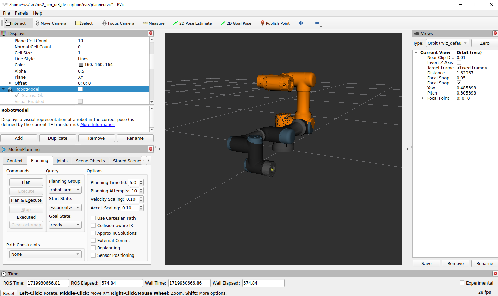

# ROS 2 Sim — High-Frequency Robot Arm Simulation

ros2_sim is a learning- and research-oriented robot arm simulator focused on **high-frequency control**, **analytical dynamics**, and **deterministic software‑in‑the‑loop (SIL)** testing. It targets kHz‑class control loops by leveraging **Pinocchio** for fast and accurate rigid‑body dynamics instead of heavy contact‑rich physics engines.

This is **not** a general-purpose physics engine or a Gazebo replacement. The intent is to teach and enable reliable controller development with a clear, inspectable dynamics pipeline.

## Table of Contents

- [Installation](#installation)
- [Usage](#usage)
  - [Preset Launch Configurations](#preset-launch-configurations)
  - [Launching the Simulation](#launching-the-simulation)
- [Visualization](#visualization)
  - [RViz2](#rviz2)
  - [ROS 2 Sim UI (separate repo)](#ros-2-sim-ui-separate-repo)
- [Academic Notes](#academic-notes)
  - [PID Controller](#pid-controller)
- [PID Tuner](#pid-tuner)
  - [ROS 2 Control](#ros-2-control-integration)
  - [Motion Planning](#motion-planning)
    - [MoveIt Integration](#moveit-integration)
    - [Custom Motion Planner Library](#custom-motion-planner-library)
- [Contributing](#contributing)
- [License](#license)

## Philosophy (Why not Gazebo?)

ros2_sim prioritizes:

- **High‑frequency control loops** (kHz‑range)
- **Analytical dynamics** (mass matrices, Jacobians, Coriolis terms)
- **Deterministic stepping** for reproducible SIL testing
- **Learning value**: dynamics are visible, hackable, and debuggable

It does **not** aim for maximum contact realism, photorealism, or full soft-body physics. Those are intentionally out-of-scope to preserve stability and performance for controller development.

## Installation

### Prerequisites

Ensure you have the following installed on your system:

- Docker
- Visual Studio Code with Remote - Containers extension

### Setting Up the Development Container

1. Clone this repository into your desired workspace directory (e.g., `~/workspace`):

    ```bash
    git clone https://github.com/PetoAdam/ros2_sim.git
    ```

2. Open the repository in Visual Studio Code:

    ```bash
    code .
    ```

3. When prompted, reopen the repository in the devcontainer. If not prompted, you can manually reopen it by pressing `F1` and selecting `Remote-Containers: Reopen in Container`.

### Building the Package

Once inside the devcontainer, first build the ros2_sim_msgs package:

```bash
cd /home/ws
colcon build --packages-select ros2_sim_msgs
```

Source the workspace
```bash
source install/setup.bash
```

And then build all the packages:
```bash
colcon build
```

# Usage

## Preset launch configurations

There are preset launch configurations that can be easily run without having to open multiple terminals for every package. Current presets:

- **launch_all_with_rviz.launch.py**: This launch file runs the simulation, the PID controller, ros2_control, MoveIt, and the RViz Visualization (with Motion Planning enabled).

    + To run it, make sure to build and source the workspace and then run:
    ```bash
    ros2 launch /home/ws/launch_all_with_rviz.launch.py
    ```

- **launch_all_with_rviz_custom_planner.launch.py**: This launch file runs the simulation, the PID controller, ros2_control, the motion planner, and the RViz Visualization packages with their correct launch files.

    + To run it, make sure to build and source the workspace and then run:
    ```bash
    ros2 launch /home/ws/launch_all_with_rviz_custom_planner.launch.py
    ```
    + To test it, run this command from another sourced terminal:
    ```bash
    ros2 action send_goal /plan_and_execute ros2_sim_msgs/action/PlanAndExecute "{target_type: 0, target_pose: {position: {x: 0.4, y: 0.0, z: 0.3}, orientation: {x: 1.0, y: 1.0, z: 1.0, w: 1.0}}, planning_pipeline: 'pilz_industrial_motion_planner', planner_id: 'PTP', timeout: 10.0, max_velocity_scaling_factor: 0.2, max_acceleration_scaling_factor: 0.1}"
    ```

- **launch_all_with_custom_planner.launch.py**: This launch file runs the simulation, the PID controller, ros2_control, the motion planner, and the gateway packages with their correct launch files.

    + To run it, make sure to build and source the workspace and then run:
    ```bash
    ros2 launch /home/ws/launch_all_with_custom_planner.launch.py
    ```
    + To test it, run this command from another sourced terminal:
    ```bash
    ros2 action send_goal /plan_and_execute ros2_sim_msgs/action/PlanAndExecute "{target_type: 0, target_pose: {position: {x: 0.4, y: 0.0, z: 0.3}, orientation: {x: 1.0, y: 1.0, z: 1.0, w: 1.0}}, planning_pipeline: 'pilz_industrial_motion_planner', planner_id: 'PTP', timeout: 10.0, max_velocity_scaling_factor: 0.2, max_acceleration_scaling_factor: 0.1}"
    ```

## Launching the simulation

To start the simulation, use the following command inside the devcontainer after making sure the workspace was built and sourced:

```bash
ros2 launch src/ros2_sim_simulation/launch/simulation.launch.py
```

## Visualization

### RViz2

RViz2 can used to render the robot inside the simulation. To launch rendering, use the following command inside the devcontainer after making sure the simulation package is running and the workspace was built and sourced:

```bash
ros2 launch src/ros2_sim_ur3_description/launch/simulation.launch.py
```

If you also wish to use the motion planning functionality launch:

```bash
ros2 launch src/ros2_sim_ur3_description/launch/planner.launch.py
```


### ROS 2 Sim UI (separate repo)

The web UI now lives in a dedicated repository:

https://github.com/PetoAdam/ros2_sim_ui

It remains an optional companion for ros2_sim, providing a lightweight, modern web-based renderer that connects to the gateway via WebSocket. See the UI repository for installation and usage details.



## Academic Notes

For a more formal overview of the dynamics, control framing, and simulation assumptions, see [docs/ACADEMIC.md](docs/ACADEMIC.md).

## PID controller

The PID controller package is responsible for turning desired joint positions into torque values for the joints.

```bash
ros2 launch src/ros2_sim_pid_controller/launch/pid_controller.launch.py
```

The PID controller can be tested via the terminal using:

```bash
ros2 topic pub /desired_positions sensor_msgs/msg/JointState "{header: {stamp: {sec: 0, nanosec: 0}}, name: [shoulder_pan_joint', 'shoulder_lift_joint', 'elbow_joint', 'wrist_1_joint', 'wrist_2_joint', 'wrist_3_joint'], position: [0.2, 0.2, 0.0, 0.0, 0.0, 0.0]}"
```

This command sends the joints to [0.2, 0.2, 0.0, 0.0, 0.0, 0.0].

## PID Tuner

You can run an automated tuner node that sweeps gain multipliers, resets the simulation between trials, and logs detailed progress:

```bash
ros2 launch ros2_sim_pid_tuner pid_tuner.launch.py
```

Tune parameters in:

```bash
src/ros2_sim_pid_tuner/config/pid_tuner.yaml
```

Modes:

- global: scales all joints together
- per_joint: tunes each joint independently
- combined: global pass, then per-joint refinement

## ROS 2 Control Integration

The project also comes with its own ros2_control integration, which converts trajectory data to joint positions, which are sent towards the PID controller.

```bash
ros2 launch src/ros2_sim_control/bringup/launch/ros2_sim_control.launch.py 
```

It can be tested via supplying it this demo trajectory:

```bash
ros2 topic pub /robot_arm_controller/joint_trajectory trajectory_msgs/msg/JointTrajectory "{header: {stamp: {sec: 0, nanosec: 0}, frame_id: base_link}, joint_names: ['shoulder_pan_joint', 'shoulder_lift_joint', 'elbow_joint', 'wrist_1_joint', 'wrist_2_joint', 'wrist_3_joint'], points: [{positions: [0, 0, 0, 0, 0, 0], velocities: [], accelerations: [], effort: [], time_from_start: {sec: 0, nanosec: 0}}, {positions: [0.8, 0.8, 0, 0, 0, 0], velocities: [], accelerations: [], effort: [], time_from_start: {sec: 3, nanosec: 0}}, {positions: [0, 0, 0, 0, 0, 0], velocities: [], accelerations: [], effort: [], time_from_start: {sec: 6, nanosec: 0}}]}" --once
```

## Motion Planning

### MoveIt Integration

This project utilizes MoveIt2 for motion planning. To enable motion planning and execute planned trajectories, follow these steps:

The motion planner UI for the default MoveIt integration runs in RViz, so make sure to run the visualization package that has motion planning included.

To launch the motion planner, run:

```bash
ros2 launch ros2_sim_moveit_config move_group.launch.py
```

Planning and executing trajectories can be done via the MotionPlanning window inside RViz:


### Custom Motion Planner Library

The custom motion planner library in this repository enhances the functionality of motion planning for the robot simulation. It integrates with MoveIt2 and provides additional capabilities tailored to specific scenarios. It uses a custom ros2 action to listen for advanced motion requests.

To launch the custom motion planner, make sure the default moveit_config motion planner library is not running and run:

```bash
ros2 launch ros2_sim_motion_planner motion_planner.launch.py
```

The library can be tested with the following commands:

Cartesian:

```bash
ros2 action send_goal /plan_and_execute ros2_sim_msgs/action/PlanAndExecute "{target_type: 0, target_pose: {position: {x: 0.4, y: 0.0, z: 0.3}, orientation: {x: 1.0, y: 1.0, z: 1.0, w: 1.0}}, planning_pipeline: 'pilz_industrial_motion_planner', planner_id: 'PTP', timeout: 10.0, max_velocity_scaling_factor: 0.2, max_acceleration_scaling_factor: 0.1}"
```

Joint Space:

```bash
ros2 action send_goal /plan_and_execute ros2_sim_msgs/action/PlanAndExecute "{target_type: 1, joint_positions: [0.5, 0.2, -0.3, 0.4, 0.0, -0.5], planning_pipeline: 'pilz_industrial_motion_planner', planner_id: 'PTP', timeout: 10.0, max_velocity_scaling_factor: 0.2, max_acceleration_scaling_factor: 0.1}"
```


## Roadmap (high‑level)

- External force/wrench injection for disturbance studies
- Deterministic stepping + fixed‑dt execution modes
- Obstacle avoidance (kinematic / Jacobian‑based)
- MCP integration (planned)
- SIL‑oriented tooling (record/replay, noise models, regression tests)

# Contributing

Contributions are welcome! Please open an issue or a pull request if you have any suggestions or improvements.

# License

This project is licensed under the MIT License. See the [LICENSE](LICENSE) file for details.